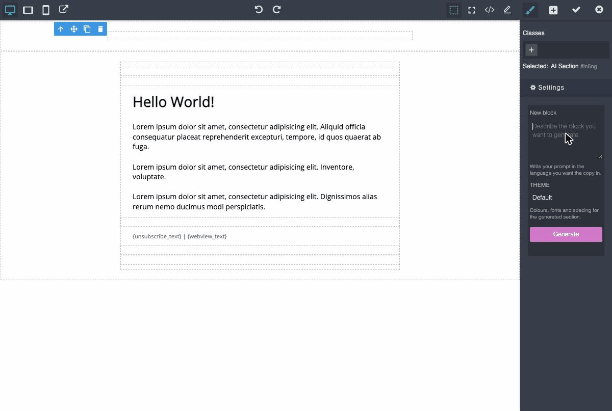

# Mautic AI Email Sections

Generates MJML sections in Mautic's email builder from a plain text description, and edits sections that already exist.



It does not generate whole emails and it does not replace the theme. The theme still owns the brand and the skeleton; this fills one section at a time.

## Requirements

- Mautic 7.x (`mautic/core-lib: ^7.0`)
- PHP 8.3
- An LLM endpoint. Either something that speaks the OpenAI chat completions shape (OpenAI, LiteLLM, Ollama, LM Studio) or the Anthropic Messages API.

No Composer dependency of its own, and no frontend build step. Both are deliberate: the runtime Mautic image has no `composer.json`, so a plugin-level dependency would never be autoloaded in production.

## Installation

### With Composer

```bash
composer require bloomidea/mautic-plugin-ai-email-sections
bin/console mautic:plugins:reload
bin/console cache:clear
```

### Without Composer

The official `mautic/mautic` Docker image ships no `composer.json`, so there `composer require` is not an option. Clone by tag instead:

```bash
cd /path/to/mautic/plugins          # or docroot/plugins on the Docker image
git clone --branch v1.0.0 --depth 1 https://github.com/Bloomidea/mautic-plugin-ai-email-sections.git AiEmailSectionsBundle
rm -rf AiEmailSectionsBundle/.git
chown -R www-data:www-data AiEmailSectionsBundle
cd /path/to/mautic
bin/console mautic:plugins:reload
bin/console cache:clear
```

The directory name must be `AiEmailSectionsBundle`. Mautic derives the bundle namespace from it.

The reload is what creates the `ai_email_sections_generation` table. Mautic plugins carry no Doctrine migrations: `PluginModel` diffs the metadata of the entities under `MauticPlugin\*\Entity` and installs the schema during the reload.

Note the two plugin layouts. In development, inside the `mautic/mautic` monorepo, plugins live in `plugins/`. At runtime, inside the `mautic/mautic:7-apache` image, they live in `docroot/plugins/`. Both are correct, and mixing them up is the single most common way to waste an afternoon.

### Local development

Develop against a clone of the `mautic/mautic` monorepo (plugins live in `plugins/` there) with DDEV:

```bash
cd /path/to/mautic
ddev config --php-version=8.3       # match what the production image runs
ddev start
ddev exec bin/console mautic:plugins:reload
```

If you keep this plugin in a sibling directory and symlink it into `plugins/`, beware that a symlink built from an **absolute host path** resolves to nothing inside the DDEV container, which only mounts the Mautic root: `mautic:plugins:reload` finds the plugin on the host and Mautic never sees it in the container. A bind mount over the same path fixes it, in `.ddev/docker-compose.customplugins.yaml`:

```yaml
services:
  web:
    volumes:
      - "../../mautic-plugin-ai-email-sections:/var/www/html/plugins/AiEmailSectionsBundle"
```

## Configuration

Settings → Plugins → **AI Email Sections**. While the integration is unpublished nothing is injected into the builder at all.

1. Open the plugin and **publish** it.
2. **Enabled/Auth** tab: paste the API key. It is stored encrypted here, and this is the only place it may go. The Features tab writes to `featureSettings`, which is plain text in the database.
3. **Features** tab: pick the **Provider**. Leaving *API base URL* and *Model name* empty uses that provider's defaults, which is the normal case.
4. Leave **Offer personalisation tokens** on unless you have a reason not to; see below for what it changes.
5. Optionally fill **Brand and tone of voice**. In a 12-case comparison this was the single change that most improved the copy.
6. Save, then confirm the block appears in the builder. If it does not, follow *Verifying it works* below rather than guessing.

The two tabs are built differently by the IntegrationsBundle and store to different places, which is why the key cannot simply be moved next to the rest of the connection settings.

| Tab | Field | Default |
|---|---|---|
| Authentication (encrypted) | API key | empty |
| Features | Provider | OpenAI-compatible |
| Features | Brand and tone of voice | empty |
| Features | Offer personalisation tokens | on |
| Features | Tokens to leave out | empty |
| Features | API base URL | follows the provider |
| Features | Model name | follows the provider |
| Features | Temperature | `0.4` |
| Features | Max tokens | `1500` |
| Features | Placeholder image URL | placehold.co |
| Features | Generations per hour, per user | `30` |
| Features | Model timeout, in seconds | `180` |
| Features | Theme tokens file (the default; the builder panel can override it per generation) | `default` |

The API key is stored on the encrypted auth tab and never reaches the browser.

**Brand and tone of voice** is optional free text describing what you sell, who you are writing to, how formal to be, and anything to avoid. It is appended to the end of the system prompt, capped at 2000 characters because it travels on every generation. Leave it empty and the assistant still works, it just writes more generic copy. In a 12-case comparison, filling it in removed every exclamation mark from the output and roughly doubled how often the copy mentioned what the company actually makes.

It sits at the end of the prompt on purpose: ahead of the allowlist, an unlucky phrasing could talk the model out of it, and the symptom would be every generation failing validation for no visible reason.

### Personalisation tokens

With **Offer personalisation tokens** on, every generation is told which tokens this install actually has. The list is collected from `EmailEvents::EMAIL_ON_BUILD`, the same event that fills the builder's own token picker, so a token added by another plugin appears here with no work on our side, and a token that is removed disappears. It is also scoped to the user making the request: someone without permission to view contact data is not offered contact fields.

Size depends on how many contact fields the install has. With Mautic's default field set the list is 58 tokens, about 2 KB, or roughly 550 input tokens per generation; an install with 38 contact and 14 company fields published comes to about 67. Count yours with `SELECT COUNT(*) FROM lead_fields WHERE is_published = 1`, and add roughly 15 for the global tokens.

Each token carries the field's label, not a description written for the model: `` `{contactfield=city}` City ``. Labels are not unique, because contact and company fields can share one, so `{contactfield=city}` and `{contactfield=companycity}` both read *City*. The token name itself is what disambiguates them.

What it changes, measured over 8 personalisation-flavoured prompts run twice through the local model, with and without the list:

| | Without the list | With the list |
|---|---|---|
| Distinct tokens ever used | 1 | 7 |
| Runs that personalised at all | 13/15 | 14/14 |
| Tokens that do not exist | none | none |
| Mean latency | 18.6 s | 20.0 s |

Without the list the model only ever reaches for `{contactfield=firstname}`, which it copied from the examples in the prompt. With the list it also uses `{signature}`, `{ownerfield=...}` and, most usefully, `{unsubscribe_url}` and `{webview_url}`.

The footer case is the one that makes the difference concrete. Asked for a newsletter footer with an unsubscribe link and a view-in-browser link, the two arms produced:

```html
<!-- without the list -->
<a href="https://example.com/unsubscribe">Unsubscribe</a>

<!-- with the list -->
<a href="{unsubscribe_url}">Unsubscribe</a>
```

Neither arm invented a token that does not exist, so the list is not what keeps the model honest; it is what lets it be useful.

**Tokens to leave out** takes one token per line, or a comma separated list, with or without braces. Anything listed there is never offered. Use it to keep a token out of generated copy, not as a security control: the tokens are not secret and a user can always type one by hand in the builder.

Turning the setting off entirely saves those ~550 input tokens per call and returns the assistant to `{contactfield=firstname}` only.

### Providers

**OpenAI-compatible** is the default and covers every endpoint that speaks the OpenAI chat completions shape.

| | Default |
|---|---|
| Base URL | `http://localhost:4000/v1` |
| Model | `qwen2.5:32b` |

For OpenAI itself, set the base URL to `https://api.openai.com/v1` and the model to `gpt-4o`. Their newer reasoning models replaced `max_tokens` with `max_completion_tokens` and stopped accepting `temperature`, so they need a client change and will otherwise return a 400.

**Anthropic** talks to the Messages API directly.

| | Default |
|---|---|
| Base URL | `https://api.anthropic.com` |
| Model | `claude-sonnet-5` |

The default is Sonnet rather than Opus on the strength of a 12-case comparison: identical first-attempt and validator-warning rates, comparable copy, roughly half the latency and half the cost. Set `claude-opus-5` if you would rather have the larger model. Leave the fields blank to accept the defaults; an explicit value always wins.

Two settings behave differently under Anthropic, because the API does:

- **Temperature is ignored.** The current models removed `temperature`, `top_p` and `top_k`, and reject requests carrying them. The Anthropic client never sends any of them; depth is controlled by the effort level instead, which is a constant in `AnthropicClient`.
- **Max tokens has a floor of 8000.** There, `max_tokens` caps reasoning and answer together rather than the visible text alone. A budget sized for the text alone gets spent thinking and the call returns truncated with nothing usable in it.

A proxy that fronts Anthropic with an OpenAI-compatible facade (LiteLLM) also works: leave the provider on OpenAI-compatible and point the base URL at the proxy. That is the better choice when you want several providers behind one endpoint, with a single place for cost logging and rate limiting.

## Verifying it works

After installing or configuring, the block should appear in the builder's **AI** category. When it does not, walk this ladder in order. Each rung tells you which layer is at fault, and every check is a command rather than a guess.

**1. Is the integration published?** The subscriber injects nothing while it is not, by design.

```bash
mysql -e "SELECT name, is_published, LENGTH(api_keys) FROM plugin_integration_settings WHERE name = 'AiEmailSections'"
```

`is_published` must be `1`. A non-zero key length confirms the key was stored encrypted.

**2. Is the subscriber in the compiled container?**

```bash
bin/console debug:event-dispatcher mautic.view_inject_custom_assets --env=prod
```

`AiEmailSectionsBundle\EventSubscriber\AssetsSubscriber::injectAssets()` must be listed. If it is not, the container predates the plugin: run `mautic:plugins:reload`, then `cache:clear`.

> **Order matters on the deploy that installs the plugin.** The configured `post_deployment_command` runs `cache:clear` when the container starts, which is *before* anyone runs `mautic:plugins:reload`. On that first deploy the subscriber can be missing from the compiled container even though every file is in place, so clear the cache again after the reload. Later deploys are fine: the plugin is already registered in the database before the container boots, and the subscriber survives on its own.

**3. Is the asset served?**

```bash
curl -o /dev/null -w '%{http_code}\n' https://<host>/plugins/AiEmailSectionsBundle/Assets/dist/index.js
```

Expect `200`. A `404` means the files did not reach `docroot/plugins/`.

**4. Is a CDN serving the old file?** Ask the origin and the edge separately, and compare the byte count:

```bash
# Edge
curl -sSI 'https://<host>/plugins/AiEmailSectionsBundle/Assets/img/icon.png?v<hash>' \
  | grep -iE 'content-length|cf-cache-status'
# Origin, from inside the web container
curl -sS -o /dev/null -w '%{size_download}\n' \
  http://localhost/plugins/AiEmailSectionsBundle/Assets/img/icon.png
```

Different sizes mean the file shipped correctly and the edge is stale.

**5. Then it is the browser.** Reload ignoring the cache, or check in devtools that `index.js` is actually requested on the builder page.

### Changing an asset needs a cache purge, every time

Mautic appends `?v<hash>` to asset URLs, and **that hash is derived from configuration, not from file contents**. Editing `index.js` or the icon therefore changes the file while leaving the URL identical, so neither the browser nor a CDN has any reason to refetch it. The new file sits on the server, correct and unreachable.

Behind Cloudflare, purging by URL means purging the exact URL *including* the query string: `icon.png?v9fbd16a` and `icon.png` are separate objects, and purging the second leaves the first, which is the one the page requests. Purging by URL failed for us on 2026-07-25 and a "Purge Everything" was what worked.

### What is *not* needed

**`mautic:assets:generate` does not help here.** It concatenates the bundles under `docroot/media/js/`, and assets added through the `VIEW_INJECT_CUSTOM_ASSETS` event never enter them: they render as their own `<script src>` tag at request time. `GrapesJsBuilderBundle` works the same way and is likewise absent from those bundles. Running it is harmless but it is not the fix, and looking for the plugin's name in `media/js/` will send you down a dead end.

## How it works

```
GrapesJS (browser)                    Mautic (server)
  "AI Section" block
  prompt trait          ── POST ──▶   GenerateController
                                        │ CSRF + permission + rate limit
                                        ▼
                                      GeneratorService
                                        ├─▶ PromptBuilder   system prompt + theme + few-shot
                                        ├─▶ LlmClient       OpenAI-compatible | Anthropic
                                        └─▶ MjmlValidator   allowlist + preservation
                                        │   (up to 3 attempts, feeding errors back)
  replaced in place   ◀── { mjml } ─────┘
```

Model output is treated as untrusted until it clears the validator. A generation that never validates changes nothing on the canvas.

The endpoint is `POST /s/ai-email-sections/generate`. Core's `RequestSubscriber` only validates `X-CSRF-Token` when `X-Requested-With: XMLHttpRequest` is present, so the frontend sends both headers explicitly and the controller validates again on its own.

## Using it in the builder

1. Create an email, pick an MJML theme, open the Builder.
2. The block panel has an **AI** category holding the **AI Section** block. Drag it onto the canvas. The settings panel opens on the prompt automatically.
3. Write what you want and press Generate. The placeholder's whole section is replaced in place, keeping its position among its siblings.
4. Write the prompt in the language you want the copy in. The system prompt and the examples are English; the copy follows the request, not the instructions. A hint under the textarea says so.
5. To change an existing section, select it and use the wand icon in the toolbar. The prompt describes the change; the current section is sent as the source. Edit mode keeps the language the section is already written in, whatever language you type the request in.
6. The whole replacement collapses into a single undo step.

## Theme tokens

One YAML file per theme in `Resources/prompts/themes/`. `default.yaml` is generic and the plugin works with nothing else, so a fresh install needs no client-specific configuration.

**Nothing parses the file.** The comments are stripped and the rest is pasted into the system prompt under a heading that tells the model to respect these values and invent no others. So the key names are a convention the model reads, not a schema the code validates: a key that is useful to a designer is useful here, and a key nobody needs costs input tokens on every generation for nothing.

That said, the model has the easiest time when the shape matches `default.yaml`:

```yaml
name: My Brand           # what the dropdowns show; without it they fall back to the file name

body:
  width: 600px
  background_color: "#fafafa"          # the page behind the email
  section_background_color: "#ffffff"  # the sections themselves

palette:                 # every colour the model is allowed to use
  text: "#000000"
  heading: "#000000"
  muted: "#787878"
  accent: "#000000"
  button_background: "#000000"
  button_text: "#ffffff"
  divider: "#e5e5e5"

typography:
  heading_font: "Georgia, Times, 'Times New Roman', serif"   # omit to use font_family throughout
  font_family: "Helvetica, Arial, sans-serif"
  heading_size: 24px
  subheading_size: 18px
  body_size: 13px
  small_size: 12px
  line_height: 20px

spacing:
  section_padding: 0px
  column_padding: 0px
  button_padding: 12px 24px

button:
  border_radius: 0px

conventions:             # free prose for what values cannot express
  - Prefer a text link over a button, which is what the brand's own template does.
```

### Choosing a theme when generating

The builder panel carries a theme selector above the Generate button, so a section can match the email it is being inserted into rather than a single install-wide choice. It opens on the theme named after the email's own template when a file of that name exists, `brienz.yaml` for an email built on the Brienz theme, and on the configured default otherwise. That is a name match and nothing else: no reading of the email's MJML and no guessing. The selector is hidden when only one theme exists.

The plugin ships token files for the five email themes Mautic builds in MJML: `attract`, `blank`, `brienz`, `confirmme` and `creative`. Mautic's other email themes are the older HTML ones, and they get no file: this plugin generates MJML and cannot target them.

Those five were sampled from each theme's own `email.html.twig` rather than written by hand, and each file's header says which values were observed and which are neutral fill-ins. Expect the observed set to be thin: the themes declare almost nothing in `mj-attributes` and put their typography inline on each element, the same way real emails do.

### Adding a theme

1. Copy `default.yaml` next to itself and give it the client's name.
2. Fill it from the MJML the client actually sends, not from a style guide. The two drift, and the template is the one telling the truth.
3. Select it in *Settings → Plugins → AI Email Sections → Features → Theme tokens file*, which sets the default, or pick it per generation in the builder panel. Both lists come from `ThemeCatalog`, which globs the directory, so a new file appears with no cache clear needed, labelled by its `name:` field.

Creating a theme needs filesystem access, which means a Mautic administrator without a shell cannot add one. That is deliberate: the file belongs in version control next to the code, not in a database column where nothing can review it.

The prompt files under `Resources/prompts/` are inputs to a language model rather than repository prose, but they are written in English like everything else here, and the copy the model produces follows the language of the request, not the language of the prompt.

## Validator

This is the load-bearing piece and the one with serious test coverage.

Allowed tags: `mj-section`, `mj-column`, `mj-group`, `mj-text`, `mj-image`, `mj-button`, `mj-divider`, `mj-spacer`. Inline HTML inside `mj-text` and `mj-button`: `p`, `br`, `strong`, `em`, `b`, `i`, `u`, `a`, `ul`, `ol`, `li`, `span`, `h1`–`h4`.

Before the strict XML parse there is a preprocessing pass, without which perfectly good MJML would be rejected: inline HTML inside `mj-text` is lifted out into opaque placeholders, repeated attributes collapse to the first, and named entities become numeric. Afterwards, empty tags are always written with an explicit closing tag (`<mj-image></mj-image>`), because `grapesjs-mjml` breaks on self-closing ones ([GrapesJS/mjml#149](https://github.com/GrapesJS/mjml/issues/149)).

After serialisation, percent-encoded braces in a token position are written back as literal braces. Both the model and libxml produce `%7Bunsubscribe_url%7D` in a link target, and Mautic replaces the literal form only, so without this pass a token used as a link ships as a link to a page that does not exist.

Edit mode adds preservation invariants. Images and `{...}` tokens are hard rejections: losing either fails the attempt. Links and text volume are soft, and on the final attempt they degrade into a visible warning rather than a failure.

## Telemetry

Every generation is recorded in `ai_email_sections_generation`: prompt, mode, theme, model, attempt count, validation errors, warnings, latency and the response that finally passed. That is what makes it possible to compare providers and models with data instead of impressions.

Retention is enforced by a command, which is not scheduled for you:

```bash
bin/console mautic:ai-email-sections:purge              # 180 day default
bin/console mautic:ai-email-sections:purge --days=90
bin/console mautic:ai-email-sections:purge --dry-run    # count, delete nothing
```

Run it daily from cron. It refuses a window below one day, since zero would empty the table rather than enforce a policy. Until it is scheduled, the table grows without bound: every row holds a prompt, a source section and a generated document.

## Permissions

The plugin registers its own permission bundle, `aiemailsections:generations`, so the assistant can be restricted per role. Without it, anyone with builder access can spend model tokens.

## Testing

```bash
cd mautic-src
ddev exec bin/phpunit -c app plugins/AiEmailSectionsBundle/Tests
ddev exec bin/php-cs-fixer fix plugins/AiEmailSectionsBundle --dry-run
ddev exec bin/phpstan analyse plugins/AiEmailSectionsBundle --level=6

cd ../plugins/AiEmailSectionsBundle
npx jest
```

135 PHP tests and 38 JS tests. The functional ones prove that the script is only injected while the integration is published, that the API key never reaches the browser, and that the endpoint refuses requests without CSRF.

Two things to know before writing tests here:

- The PHPUnit config lives at `app/phpunit.xml.dist`, so functional tests need `-c app`. Without it they fail on a missing `KERNEL_CLASS` that has nothing to do with the test.
- **The test container replaces `HttpClientInterface` with a `MockHttpClient`** that answers HTTP 200 with an empty body. A test that looks like it calls an external service silently gets that instead. To exercise a real endpoint, build the client around `HttpClient::create()` explicitly.

PHPStan needs the Symfony test container at `var/cache/test/AppKernelTestDebugContainer.xml`. If you have cleared the test cache, regenerate it with `APP_ENV=test APP_DEBUG=1 bin/console cache:warmup` or PHPStan refuses to start.

## Frontend

`Assets/dist/index.js` is served as-is. The plugin imports nothing (it receives the `editor` as an argument), so `npm run build` is a copy from `Assets/src/` and there is no bundler. If imports ever become necessary, move to `grapesjs-cli build` the way [`GrapesJsCustomPluginBundle`](https://github.com/mautic/GrapesJsCustomPluginBundle) does.

Registration goes through `window.MauticGrapesJsPlugins` with `context: ['email-mjml']`, the documented extension point of `GrapesJsBuilderBundle`. Custom plugins load last in `grapesjs.init()`, after `grapesjs-mjml` has run its `resetBlocks`.

Two traps when working on this file:

- **Assets are versioned by a hash that does not change when you edit them.** Mautic appends `?v<hash>` derived from configuration, not from file contents, so the browser keeps serving the cached copy indefinitely. Force a refresh against the exact URL *including* the query string, or disable cache in devtools.
- **`element.click()` produces false negatives on GrapesJS toolbars.** They respond to `mousedown`, and a synthetic click does not generate the full event sequence. Use a real click or dispatch `mousedown` explicitly.

## Known gaps

- The purge command exists but nothing schedules it. Add it to cron.
- Theme token files ship for the stock Mautic MJML themes only. Add your brand as another YAML file in `Resources/prompts/themes/`; a file named after your Mautic theme (or its family, for language variants like `mytheme-pt`) is picked automatically.
- Accented characters serialise as numeric entities inside attributes (`alt="&#xCD;cone 1"`). Cosmetic, renders correctly.
